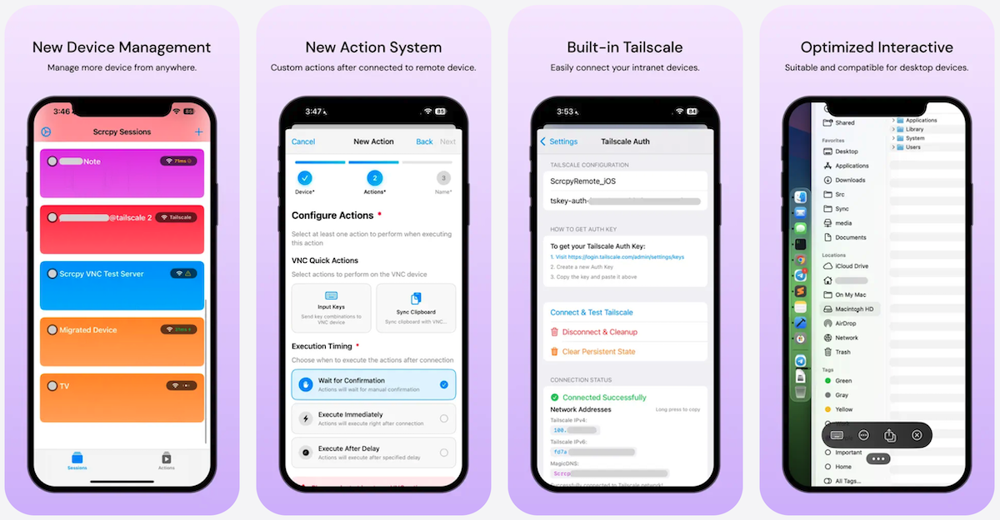

Scrcpy Remote is a powerful iOS application that enables seamless control of your computers and Android devices from anywhere. Built on proven technologies like VNC and scrcpy, it brings desktop-class remote control to your iPhone and iPad.

[](https://apps.apple.com/us/app/scrcpy-remote/id1629352527)
[](https://github.com/wsvn53/scrcpy-mobile)



## Main Features

### Device Control
- **VNC Support**: Control Mac computers, Windows PCs, and Linux machines via VNC protocol
- **ADB/Scrcpy Integration**: Mirror and control Android devices with low latency using scrcpy (currently v3.3.3)
- **Optimized Performance**: Hardware-accelerated video decoding and low-latency touch event processing for smooth, responsive remote control on mobile devices
- **Multi-Device Management**: Save and manage unlimited device sessions with automatic type detection
- **Fully Local & Private**: All data stored locally in iOS Keychain only - no external servers, no cloud storage, no data collection. Your connections stay completely private and secure

### Network Connectivity
Connect to your devices anywhere - whether on your local network at home or remotely from anywhere in the world via Tailscale:
- **Local Network**: Direct TCP connections for fast, low-latency control on the same network
- **Embed Tailscle**: Secure peer-to-peer encrypted connections via Tailscale VPN to access your devices from anywhere

### Advanced Features
- **Actions System**: Create automated task sequences that execute on connection
- **Live Activity**: Real-time connection status in Dynamic Island and Lock Screen (iOS 16.1+)

## How to Use with VNC Devices

### Initial Setup

1. **Prepare Your Computer**
   - **Mac**: Enable Screen Sharing in System Preferences > Sharing
   - **Windows**: Install VNC server like TightVNC, RealVNC, or UltraVNC
   - **Linux**: Install and configure VNC server (x11vnc, TigerVNC, etc.)
   - Note the VNC port (default: 5900) and set a password

2. **Create VNC Session**
   - Open Scrcpy Remote app
   - Tap the "+" button to add a new session
   - Enter session details:
     - **Session Name**: A friendly name (e.g., "My MacBook")
     - **Host**: IP address or hostname
     - **Port**: VNC port (usually 5900)
     - **Username**: VNC username (if required)
     - **Password**: VNC password

3. **Configure VNC Options**
   - **Compression Level**:
     - None: Best quality, requires good network
     - Standard (6): Balanced performance
     - Maximum (9): Slowest but works on poor connections
   - **Quality Level**: 0 (lowest) to 9 (highest)
   - Enable **Continuous Updates** if your VNC server supports RFC 6121 for better performance

### Connecting

1. Tap on your saved VNC session
2. Wait for connection to establish
3. Once connected, you'll see your computer screen
4. Use touch gestures to control:
   - **Single tap**: Left click
   - **Two-finger tap**: Right click
   - **Pinch**: Zoom in/out
   - **Drag**: Move mouse cursor
   - **Scroll**: Two-finger swipe

### VNC Connection Tips

- **For Best Quality**: Use Direct Connection on same network with Compression: None, Quality: 9
- **For Remote Access**: Enable Tailscale for secure encrypted connection
- **For Slow Networks**: Increase compression to Maximum (9), reduce quality to 3-5
- **Keyboard Shortcuts**: Tap keyboard icon to send special keys (Ctrl+Alt+Del, etc.)

## How to Use with ADB Devices

### Initial Setup

1. **Prepare Your Android Device**
   - Enable Developer Options: Settings > About Phone > Tap "Build Number" 7 times
     - **Note**: Some Android ROMs (Samsung, Xiaomi, OPPO, etc.) may have different methods to enable Developer Options. Please check your phone manufacturer's manual if this method doesn't work
   - Enable USB Debugging: Settings > Developer Options > USB Debugging
   - Enable Wireless Debugging (Android 11+): Developer Options > Wireless Debugging
   - Note the IP address and port shown in Wireless Debugging settings

2. **Alternative: USB Connection**
   - Connect Android device to computer via USB
   - Run `adb tcpip 5555` on computer
   - Disconnect USB, device is now accessible at `device-ip:5555`

3. **Create ADB Session**
   - Open Scrcpy Remote app
   - Tap "+" to add new session
   - Enter session details:
     - **Session Name**: Device name (e.g., "Pixel 8")
     - **Host**: Android device IP address
     - **Port**: 5555 (or wireless debugging port)

   > **💡 Smart Detection**: The app automatically detects ADB ports (like 5555) and switches to ADB options. If you're in VNC options and want to force ADB mode, add the `adb://` prefix to the host field (e.g., `adb://192.168.1.100`).

4. **Configure ADB Options**
   - **Video Codec**: H.264 (widely compatible) or H.265 (better compression)
   - **Audio Codec**: Opus (recommended), AAC, FLAC, or RAW
   - **Resolution**: Max resolution or custom (e.g., 1920)
   - **Bitrate**: 8000000 (8 Mbps) default, adjust based on network
   - **FPS**: 60 recommended, lower for slower networks
   - **Hardware Decoding**: Enabled by default for better performance

5. **Virtual Display Options**
   - Enable **Virtual Display** to control device without disturbing physical screen
   - Set custom resolution and DPI for virtual display

### Connecting

1. Tap on your ADB session
2. **First Connection**: Approve the connection on your Android device
3. Once connected, you'll see your Android screen mirrored
4. All touch, keyboard, and gesture inputs work seamlessly

### ADB Features

- **Clipboard Sync**: Copy/paste between iPhone and Android
- **Volume Control**: Adjustable volume scale
- **Power Management**:
  - Turn off screen on disconnect to save battery
  - Stay awake mode keeps device active
- **Screen Recording**: All Android screen activity is mirrored in real-time

### ADB Connection Tips

- **First Time**: Must approve ADB connection on Android device screen
- **Connection Lost**: Re-enable wireless debugging or reconnect USB
- **Performance**: Use H.264 codec for compatibility, H.265 for bandwidth savings
- **Audio Issues**: Try different audio codecs if audio doesn't work
- **Resolution**: Lower resolution improves performance on slower networks

## How to Use Actions System

The Actions system allows you to automate repetitive tasks by creating sequences of operations that execute automatically when connecting to devices.

### Creating Actions

1. **Navigate to Actions**
   - Open Scrcpy Remote app
   - Tap "Actions" tab in bottom navigation
   - Tap "+" to create new action

2. **Action Configuration**
   - **Action Name**: Descriptive name (e.g., "Open Terminal")
   - **Device**: Select target device (VNC or ADB)
   - **Execution Timing**:
     - **Immediate**: Runs right after connection
     - **Delayed**: Runs after X seconds
     - **Confirmation**: Waits for manual approval

### VNC Action Types

#### 1. Input Keys
Send keyboard shortcuts automatically:
- Select keys and modifiers (Ctrl, Alt, Shift, Cmd)
- Configure key interval (delay between keypresses)
- Example: Send `Cmd+Space` to open Spotlight on Mac

**Use Cases:**
- Open applications on login
- Execute keyboard shortcuts
- Type predefined text

#### 2. Sync Clipboard
Automatically synchronize clipboard content between devices.

### ADB Action Types

#### 1. Home Key
Press Android Home button (equivalent to `adb shell input keyevent 3`)

#### 2. Switch Key
Open App Switcher (equivalent to `adb shell input keyevent 187`)

#### 3. Input Keys
Send Android keyevent sequences:
- Supports 285+ Android keycodes
- Includes media keys, navigation, gaming buttons
- Configure key intervals

**Examples:**
- KEYCODE_VOLUME_UP (24)
- KEYCODE_CAMERA (27)
- KEYCODE_MEDIA_PLAY_PAUSE (85)
- KEYCODE_APP_SWITCH (187)

#### 4. Shell Commands
Execute custom ADB shell commands:
```bash
# Open specific app
am start -n com.android.chrome/com.google.android.apps.chrome.Main

# Change settings
settings put system screen_brightness 255

# Take screenshot
screencap -p /sdcard/screenshot.png
```

### Action Examples

#### Example 1: Auto-Login Mac and Open Apps
```
Action Name: "Mac Startup Routine"
Device: MacBook Pro (VNC)
Timing: Delayed (3 seconds)

Steps:
1. Input Keys: Cmd+Space (Open Spotlight)
2. Input Keys: "Terminal" + Enter (Open Terminal)
3. Input Keys: Cmd+T (New Tab)
4. Input Keys: "code" + Enter (Open VS Code)
```

#### Example 2: Android App Launch
```
Action Name: "Open YouTube Music"
Device: Pixel 8 (ADB)
Timing: Immediate

Steps:
1. Home Key (Go to home screen)
2. Shell Command: am start -n com.google.android.apps.youtube.music/com.google.android.apps.youtube.music.activities.MusicActivity
```

#### Example 3: Android Device Setup
```
Action Name: "Night Mode Setup"
Device: Galaxy S23 (ADB)
Timing: Confirmation

Steps:
1. Shell Command: settings put system screen_brightness 50
2. Shell Command: settings put secure ui_night_mode 2
3. Input Keys: KEYCODE_VOLUME_DOWN (repeat 5 times)
```

### Managing Actions

- **Edit**: Tap on action to modify settings
- **Duplicate**: Long-press action and select "Duplicate"
- **Delete**: Swipe left on action
- **Enable/Disable**: Toggle switch on action card

### Action Best Practices

- **Test First**: Always test actions manually before automating
- **Use Delays**: Add appropriate delays between steps for UI to respond
- **Confirm Critical Actions**: Use "Confirmation" timing for destructive operations
- **Device-Specific**: Create separate actions for different device types
- **Naming**: Use descriptive names to identify actions quickly

## Q&A

### Connection Issues

**Q: VNC connection fails immediately**
- Verify VNC server is running on target computer
- Check firewall settings allow VNC port (default 5900)
- Confirm correct IP address and port
- Try disabling compression temporarily
- Ensure VNC server supports remote connections

**Q: ADB connection shows "Device Unauthorized"**
- Check Android device screen for authorization popup
- Approve the connection on Android device
- If popup doesn't appear, disable and re-enable USB debugging
- Try revoking USB debugging authorizations in Developer Options

**Q: Connection works locally but not remotely**
- Use Tailscale for secure remote access
- Check router port forwarding if using direct connection
- Verify target device has public IP or proper NAT configuration

### Performance Issues

**Q: Video is laggy or choppy**
- **For VNC**: Increase compression, reduce quality level
- **For ADB**: Lower resolution (try 1280), reduce bitrate to 4000000
- **For ADB**: Reduce FPS to 30
- Close other apps using network bandwidth

**Q: Audio is out of sync (ADB)**
- Try different audio codec (Opus recommended)
- Reduce video bitrate
- Check network stability
- Enable hardware decoding if disabled

**Q: High battery drain on Android device**
- Enable "Turn off screen on disconnect"
- Lower FPS to 30
- Reduce resolution
- Disable audio if not needed
- Use virtual display mode

### Feature Questions

**Q: Can I control multiple devices simultaneously?**
- Yes, create separate sessions for each device
- Each connection runs independently
- Actions are device-specific

**Q: Does it work over cellular/mobile data?**
- Yes, but requires Tailscale or VPN for secure connection
- Not recommended for direct connections due to security risks
- Performance depends on cellular network quality

**Q: Can I transfer files?**
- VNC: Clipboard sync only (copy/paste text)
- ADB: Use shell commands with `adb push/pull` equivalent operations
- Consider using dedicated file transfer tools for large files

**Q: Is it secure?**
- Tailscale connections: End-to-end encrypted, very secure
- Direct VNC: Encrypted if VNC server supports it (check server docs)
- Direct ADB: Unencrypted, use only on trusted networks or via Tailscale
- All credentials stored in iOS Keychain (encrypted)

**Q: What's the difference between normal and virtual display (ADB)?**
- **Normal**: Mirrors actual device screen, requires device to be unlocked
- **Virtual**: Creates hidden virtual screen, works when device is locked
- Virtual display is perfect for automation without disturbing physical device

### Troubleshooting

**Q: Picture-in-Picture not working**
- Requires iPhone 6s Plus or newer (or any iPad)
- iOS Simulator doesn't support PIP, test on real device
- Check if PIP is enabled in iOS Settings > General > Picture in Picture

**Q: Actions not executing**
- Verify action device type matches session device type
- Check execution timing settings
- Ensure device is fully connected before action triggers
- Review action steps for errors (test manually first)

**Q: Live Activity not showing**
- Requires iOS 16.1 or later
- Check Focus mode settings (may hide notifications)
- Restart app if Live Activity becomes orphaned
- Enable notifications for Scrcpy Remote in iOS Settings

**Q: App crashes on connection**
- Update to latest version
- Check device compatibility (iOS 15.0+)
- Enable logging in Settings and check logs
- Report issue with log file

**Q: Keyboard input not working (VNC)**
- Check VNC server keyboard layout settings
- Try enabling/disabling continuous updates
- Some special keys may not be supported by VNC server
- Use on-screen keyboard instead of hardware keyboard

### Network Setup

**Q: How do I set up Tailscale?**
1. Create Tailscale account at tailscale.com
2. Generate auth key in Tailscale admin console
3. Enter auth key in Scrcpy Remote Settings > Tailscale
4. Enable "Use Tailscale" toggle when creating session
5. Use Tailscale device hostname or IP

**Q: What ports do I need to open?**
- **VNC**: TCP port 5900 (or custom VNC port)
- **ADB**: TCP port 5555 (or wireless debugging port)
- **Tailscale**: Handled automatically, no manual port forwarding needed

### Advanced Usage

**Q: Can I use custom scrcpy server version?**
- App includes scrcpy server 3.2
- Custom server replacement not currently supported
- Request feature if needed for specific scrcpy version

**Q: How do I import/export ADB keys?**
- Import/export settings are not visible in the main Settings by default
- First, add an ADB device (tap "+" and create an ADB session), then you'll now see the ADB key import/export options
- Use this to share ADB authorization across devices or backup your keys

**Q: How do I export/import sessions?**
- Currently manual backup via iCloud
- Sessions stored in iOS Keychain
- Automatically migrates from legacy scrcpy-ios app

**Q: Can I automate actions from external apps?**
- Yes, via URL scheme support
- Deep linking allows external app integration
- Format: `scrcpy-remote://session/{session-id}`

**Q: Where are logs stored?**
- Enable logging in Settings
- Logs accessible via Settings > View Logs
- Export logs for troubleshooting
- Logs include connection details and error messages

---

## Support & Feedback

For issues, feature requests, or questions:
- GitHub Issues: Report bugs and request features
- Documentation: Check in-app help for specific features
- Logging: Enable logging in Settings to diagnose issues

## System Requirements

- iOS 15.0 or later
- iPhone or iPad
- For Live Activity: iOS 16.1+
- For Picture-in-Picture: iPhone 6s Plus+ or iPad

## Credits

Built with:
- **scrcpy**: Android screen mirroring (Genymobile)
- **LibVNCClient**: VNC protocol implementation
- **SDL2**: Cross-platform multimedia library
- **Tailscale**: Secure network connectivity

---

**Version**: 4.3.2
**License**: Check repository for license information
